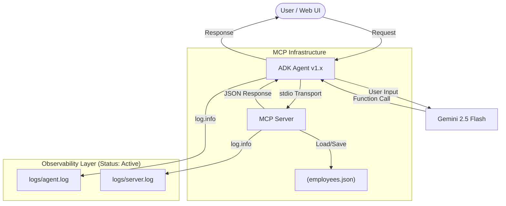

# POC: Agent Observability with Model Context Protocol (MCP)

## Executive Summary
This Proof of Concept (POC) demonstrates a robust observability and data persistence system for an AI-powered HR Assistant built using the Google Agent Development Kit (ADK) 1.x and the Model Context Protocol (MCP).

## 1. Problem Statement
AI Agents often operate as "black boxes," making it difficult to:
- **Debug Tool Failures**: Identifying why a tool call failed or received unexpected results.
- **Audit Agent behavior**: Tracking the exact interaction loop between the User, LLM, and external data sources.
- **Trace Latency**: Understanding where bottlenecks occur in the Agent/Server communication.
- **Maintain Data State**: Moving from hardcoded data to a persistent, manageable data store without disrupting business logic.

## 2. Solution: MCP-Powered Observability
The solution implements a dual-layered observability stack using the Model Context Protocol (MCP) as the standardized interface.

### Key Components:
1.  **ADK Agent (Consumer)**: An HR Assistant that interprets user intent and routes requests to tools.
2.  **MCP Server (Provider)**: A standardized server managing employee data via a JSON-based persistent store ([employees.json](file:///d:/GENAI/IT Industry_POC/adk-mcp-demo/mcp-server/employees.json)).
3.  **Observability Layer**: 
    - **Server-Side**: Instrumented tool decorators that log every request payload and JSON response to [server.log](file:///d:/GENAI/IT Industry_POC/adk-mcp-demo/mcp-server/logs/server.log).
    - **Agent-Side**: Configured Python logging to capture high-level `User Request`, `LLM Tool Calls`, and `Agent Response` in [agent.log](file:///d:/GENAI/IT Industry_POC/adk-mcp-demo/MCPAgent/logs/agent.log).

## 3. Architecture Overview

## 4. Technical Implementation Details

### Data Management
- **Persistence**: Extracted hardcoded data into a centralized [employees.json](file:///d:/GENAI/IT Industry_POC/adk-mcp-demo/mcp-server/employees.json) file.
- **Scalability**: Implemented mechanisms to dynamically load and persist employee records, including batch generation of test data.

### Logging Strategy
- **Isolation**: Server logs are strictly file-based to avoid polluting the `stdio` stream used for MCP communication.
- **Granularity**: The system captures the full interaction loop without exposing deep internal library debug traces (unless explicitly enabled).
- **Manageability**: Uses `RotatingFileHandler` to prevent log files from growing indefinitely.

## 5. Industrial Benefits
- **Governance**: Every employee interaction is audited and traceable.
- **Interoperability**: Using MCP ensures the server can be reused by any compliant agent client (e.g., Claude, Custom IDEs).
- **Separation of Concerns**: Business logic remains decoupled from the data access and logging infrastructure.

---
