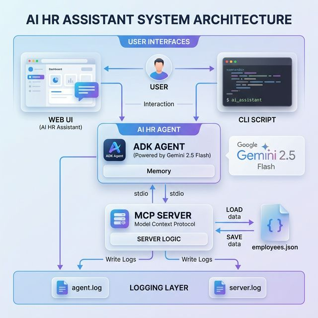

# ADK + MCP Employee HR Assistant

A complete, production-ready example of the **Google Agent Development Kit (ADK) 1.x** integrated with a **Model Context Protocol (MCP)** server. This project demonstrates full CRUD operations on a persistent JSON-based employee database with built-in observability and monitoring.

---

## 📸 Architecture Overview



---

## 📁 Project Layout

```bash
adk-mcp-demo/
├── mcp-server/
│   ├── server.py          # FastMCP server exposing 6 CRUD tools
│   ├── data/
│   │   └── employees.json # Persistent JSON data store
│   └── logs/
│       └── server.log     # Tool-level request/response logs
├── MCPAgent/              # Agent for 'adk web' UI
│   ├── agent.py           # Root agent configuration
│   └── logs/
│       └── agent.log      # Web UI interaction logs
└── adk-agent/             # Script-based Agent (Interactive/Demo)
    ├── agent.py           # Customizable agent handling interaction loops
    └── logs/
        └── agent.log      # Turn-by-turn request/response logs
```

---

## 🛠️ MCP Server Tools

| Tool                   | Operation | Description                     |
| ---------------------- | --------- | ------------------------------- |
| `list_employees`       | READ      | List all, filter by dept/status |
| `get_employee`         | READ      | Fetch single employee by ID     |
| `create_employee`      | CREATE    | Add new employee record         |
| `update_employee`      | UPDATE    | Patch one or more fields        |
| `delete_employee`      | DELETE    | Remove employee permanently     |
| `get_department_stats` | READ      | Headcount + avg salary per dept |

---

## 📊 Observability & Monitoring

The system is equipped with high-level `INFO` logging to provide clear visibility without library-level noise.

### Agent-Side Logs (`agent.log`)
Captures the interaction loop between the user and the LLM:
- **User Request**: Every high-level query received.
- **Agent Response**: The final summarized output from the model.

### Server-Side Logs (`server.log`)
Captures the data-layer interaction (MCP tools):
- **Request Payloads**: Arguments passed to tools (e.g., filtered departments).
- **JSON Responses**: The raw data returned to the agent from the persistence layer.

---

## 🚀 Quick Start

### 1. Configure Environment
Create a `.env` file in the root with your Gemini API key:
```bash
GOOGLE_API_KEY=your-api-key-here
```

### 2. Run with Web UI (adk web)
Recommended for a rich, visual chat experience.
```bash
adk web
```

### 3. Run with Script (Demo/Interactive)
Recommended for automated testing and structured monitoring.
```bash
# Automated demo (exercises all tools)
python adk-agent/agent.py demo

# Interactive CLI chat
python adk-agent/agent.py interactive
```

---

## 💡 Key Technical Features

- **Persistent JSON Store**: Moving beyond in-memory dicts, all employee data is now persisted to `employees.json`.
- **FastMCP Integration**: Uses the latest decorators for zero-boilerplate tool discovery.
- **Metadata Management**: The script-based runner is optimized to capture session context and timestamps in high-level logs.
- **Clean Transport**: Server-side logs are isolated to files to prevent any interference with the `stdio` communication stream.

---
*Developed for KPMG POC - Employee HR Assistant Agent.*
